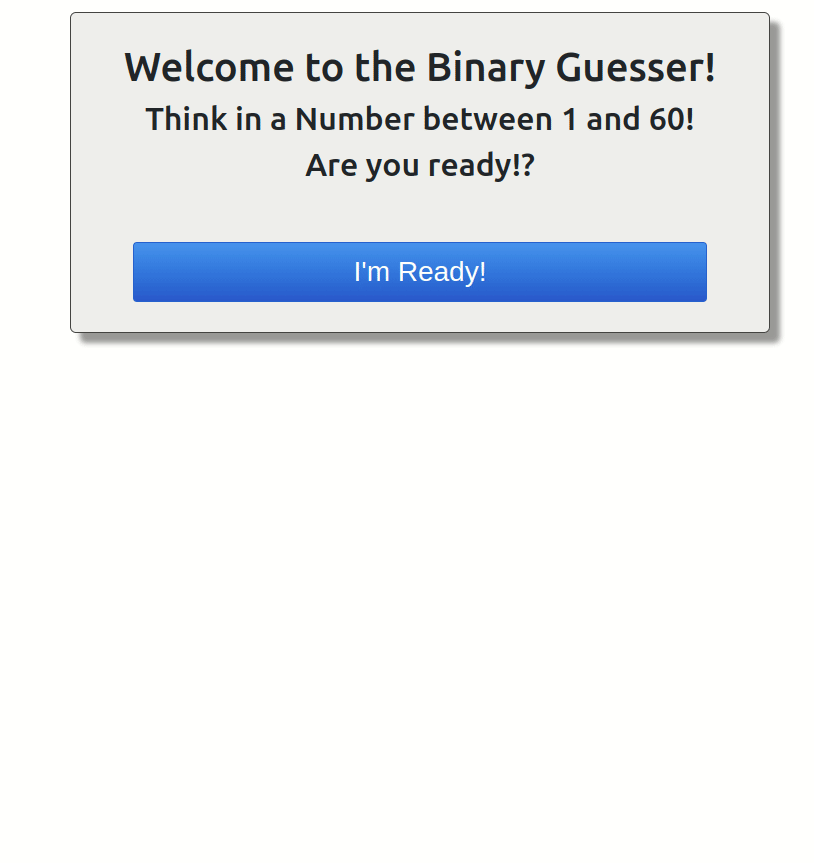

# Welcome to the Binary Guesser - React Project

Binary Guesser is a React project created to consolidate knowledge of the React framework. It is a simple guessing game where the user thinks of a number between 1 and 60, and the program uses a binary composition to determine the user's number based on their responses to a set of cards.

## Table of Contents

- [Demo](#demo)
- [Features](#features)
- [Getting Started](#getting-started)
- [How to Play](#how-to-play)
- [Technologies Used](#technologies-used)

## Demo


## Features

- Simple and engaging guessing game.
- Utilizes binary composition for an efficient guessing process.

## Getting Started

Follow these instructions to get a copy of the project up and running on your local machine.

### Prerequisites

- **Node.js** and **npm** installed on your machine.

### Installing

1. Clone the repository:

   ```bash
   git clone https://github.com/your-username/binary-guesser.git
   ```
2. Change to the project directory:

    ```bash
    cd binary-guesser
    ```
3. Install the Dependencies:
    ```bash
    npm install
    ```
4. Star the Local Server:
    ```bash
    npm start
    ```

## How to Play
1. Think of a number between 1 and 60.
2. Respond to each card by saying YES or NO if the number you thought is on the card.
3. After the 6th card, the program will determine your number.

## Technologies Used
 - [React](https://react.dev/)
 - [Vite](https://vitejs.dev/)
